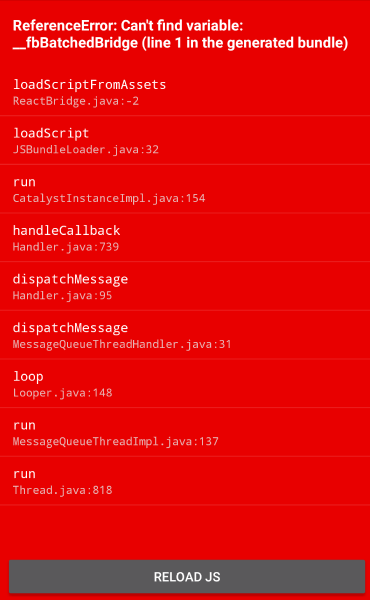

# react-native-issue-highlights
React Native问题集锦，记录我在使用React Native（主要是Android）过程中遇到的问题。

## 1. ReferenceError: Can't find variable: __fbBatchedBridge
<div align="center"></div>

使用初期经常会遇到的问题，一在模拟器（或真机）上跑，就出现满江红。试了[StackOverflow上的解决办法](http://stackoverflow.com/questions/34500020/referenceerror-cant-find-variable-fbbatchedbridge)，依然不行。愤懑之下重新装了一个模拟器就好了。。。不明觉厉。

## 2. 实现圆形切图
<div align="center"></div>

```javascript
<Image 
    style={{height: 100, width: 100, borderRadius: (100 / 2) }}
    source={**} />
```
一定不能加`resizeMode`，否则怎么切图都不对。
PS：在其他情况下也是，慎用`resizeMode`。

## 3. Navigator中Scene的滑动问题
<div align="center"></div>

在使用Navigator的时候，滑动当前的Scene可能会导致当前的Scene的位置移动，有时这并不是我们想要的。比如在最顶层的Navigator，我们不希望主页Scene的位置随着手的滑动而“漂移”，
```javascript
<Navigator
    initialRoute={initialRoute}
    renderScene={this._renderScene}
/>
```
其实只需要不加`configureScene`属性就好了，主页Scene坚如磐石。而且在主页Scene与其他Scene之间切换的时候，会有一个默认的、平滑的动画。

## 4. TypeError: Network request failed
在本地也启动了一个服务器（Tomcat，基于JavaEE，比如：localhost:8080），作为应用的后台，提供数据操作等。因为App在模拟器上跑的时候在本地也启动了一个服务器（为了便于调试，比如：localhost：8081）。在使用`fetch`方法进行访问后台操作时，报`TypeError: Network request failed`错。[Github](https://github.com/facebook/react-native/issues/5584)或[StackOverflow](http://stackoverflow.com/questions/34570193/react-native-post-request-via-fetch-throws-network-request-failed)上的答案都无法解决这个问题。后来我把`localhost`改成了`本机IP地址`，问题就解决了。
```javascript
async _fetchData() {
    const responseJson = await fetch("http://192.168.56.1:8080/ScholarHome/News/SearchNews", {
        method: "POST",
        headers: {
          "Accept": "application/json",
          "Content-Type": "application/json",
        },
        body: JSON.stringify({
            "channelId": "2",
            "pageIndex": "0",
            "pageSize": "10"
        })
    })
    .catch((error) => {
        console.warn(error);
    });

    if (responseJson.ok) {
        const dataJson = await responseJson.json().catch((error) => { 
            console.warn(error); 
        });

        console.log(dataJson.data.topNews);
    }
}
```
